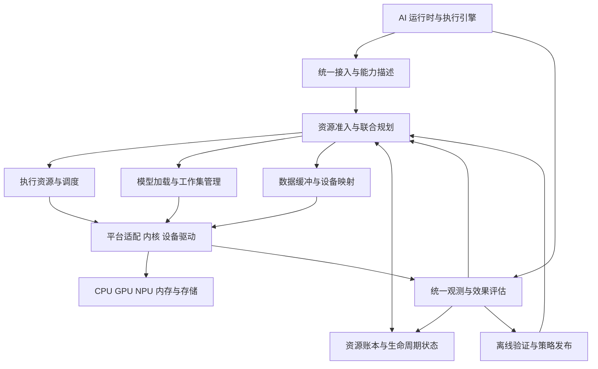

# 端侧 AI 内核资源管理与运行支撑闭环框架项目方案

本项目面向端侧 AI 工作负载，建设由内核研发团队牵头的资源管理与运行支撑框架，贯通模型加载、驻留管理、资源分配、执行调度、数据流转、观测反馈和异常恢复。

**核心目标是将分散在运行时、系统服务、内核和驱动中的资源行为，组织成有状态、可计量、可协调、可恢复的完整闭环。** 通过统一的任务描述、资源账本、执行计划和状态反馈，在有限算力、内存、带宽与功耗条件下，提高 AI 负载的可承载能力、执行效率和运行稳定性。

“内核侧”在本项目中指操作系统内核及设备驱动对 AI 的支撑能力。模型解析、编译和语义缓存管理由运行时承担，跨资源策略在用户态协调，内核与驱动提供资源机制、隔离、同步及执行反馈。方案范围包括原有的资源调度、模型内存、全链路观测和数据缓冲四个方向。

方案日期为 2026 年 10 月 6 日。公开平台能力在对应段落给出来源；框架接口、实现路径与预期收益为拟议设计，具体收益通过目标平台实验确定。

## 一 项目背景

### AI 运行正在形成完整的系统资源链路

端侧模型执行涉及文件读取、编译产物加载、权重驻留、临时工作区分配、设备映射、主机与加速器协同以及中间结果流转。首次运行、重复运行、并发运行和内存压力后的恢复，会走过不同的资源路径。单个算子或单次推理速度，只反映其中一部分成本。

已有运行时支持提前编译或设备端编译，并提供部分硬件缓冲互操作能力。具体能力因后端而异，也会改变初始化开销、内存需求与加载状态的定义。[LiteRT NPU 加速与编译支持](https://developers.google.com/edge/litert/next/npu)

### 通用资源机制需要与 AI 负载语义建立联系

内核能够观测线程、页面、I/O、设备状态和调度等待；运行时掌握模型阶段、工作集组成、缓存可重建性与可让出边界。分散的信息需要通过明确协议关联，才能回答“是否允许加载”“应保留哪些资源”“当前任务何时可以让出”“回收后恢复需要多少代价”。

Android 已开始提供系统级 NPU 加载准入与优先级协调。项目应在实际平台能力之上建立协同框架，并通过适配器连接不同运行时与驱动。[AOSP NPU Manager](https://source.android.com/docs/core/perf/npu-manager)

### 主要问题集中在生命周期衔接

| 系统问题 | 典型表现 | 框架需要补齐的能力 |
| - | - | - |
| 加载状态不清晰 | 文件已映射，但设备上下文仍未就绪 | 分阶段加载状态与统一就绪判定 |
| 资源需求估计不完整 | 稳态可以驻留，加载或恢复峰值却超预算 | 生命周期峰值估算与加载准入 |
| 内存归属分散 | 主机、共享缓冲与设备占用重复或遗漏 | 可核对的工作集与物理资源账本 |
| 调度与回收各自决策 | 已回收对象被立即重新加载，产生振荡 | 调度、驻留和恢复联合规划 |
| 数据流转缺少生命周期约束 | 重复映射、额外复制、长期占用或过早释放 | 缓冲身份、引用与完成依赖管理 |
| 观测停留在结果统计 | 能看到慢或耗电，难定位具体阶段 | 请求到内核和设备事件的关联 |
| 异常处理不闭合 | 取消、超时、重启后资源残留或状态不一致 | 执行确认、补偿清理与状态重建 |

## 二 项目定位与价值

### 项目定位

建设面向 AI 工作负载的系统资源协同层，以内核和驱动机制为基础，向运行时提供一致的资源申请、状态查询、调度协作、释放恢复和观测能力。

框架的管理对象是模型运行上下文、请求、工作集、设备作业和数据缓冲。项目以这些对象的生命周期为主线，使每次加载有准入依据、每次分配有明确归属、每次调度有可执行边界、每次释放有完成确认、每次优化有反馈验证。

### 核心价值

**提高有效资源利用率。** 通过减少重复加载、重复分配、无效映射和不必要的数据移动，把已有硬件能力转化为可持续的负载承载能力。利用率提高必须与有效完成量和资源成本共同评估。

**提高运行可预测性。** 将加载、排队、执行和恢复的开销纳入同一计划，控制并发、资源峰值和不可中断区间。对无法满足目标的请求明确延期、拒绝或采用已允许的替代计划。

**提高系统稳定性。** 将模型与缓冲的在途状态纳入资源回收，覆盖取消、进程退出、服务重启和设备故障，减少资源泄漏、错误复用与恢复失败。

**形成可复用的平台资产。** 统一协议、账本、观测和验证体系可以跨模型与运行时复用；平台差异集中在能力描述与适配器中，便于升级维护。

**形成内核团队可归因的技术成果。** 将成果落实为可验证的资源机制、驱动改进、加载与恢复优化、统一诊断能力和回归体系，并通过受控实验区分各模块和联合框架的贡献。

## 三 总体思路

### 以资源生命周期组织能力

框架围绕“需求描述、准入准备、加载驻留、分配调度、执行观测、调整回收、恢复复用”运行。四个建设方向分别承担执行资源、内存对象、数据缓冲和反馈评估，共用同一套对象身份与执行状态。

资源决策同时考虑任务目标、平台能力、当前状态和变更成本。对于一个候选执行计划，需要估计排队、加载、计算、数据移动及恢复的关键路径，并检查资源峰值是否可承受。可并行阶段按依赖关系计算，不将所有局部耗时直接相加。

### 策略与机制分层协作

用户态协调服务负责准入、预算、计划选择和跨对象生命周期；运行时负责模型语义、工作集声明与实际执行切分；内核和驱动负责调度机制、内存与 I/O 支撑、设备访问、同步及状态反馈。

每个可写控制量有明确的策略拥有者。框架通过既有系统服务和厂商接口提交有界需求，记录实际生效值。现有热保护和设备安全限制保留最终约束，避免多个控制器反复争夺同一资源参数。

### 从可解释的闭环开始

第一阶段使用已验证的计划模板、规则、阈值和实测代价表。先让状态真实可见、动作可确认、效果可验证，再考虑预测模型或更复杂的在线策略。预测能力作为增量模块接入，不成为基础框架可运行的前提。

优化目标采用约束优先的方式：满足正确性、隔离和系统保护要求，在约定时延、功耗及资源边界内，提高有效完成量并降低资源成本。无法支持的能力明确暴露，不向上层承诺虚假的统一语义。

## 四 框架设计

### 总体架构

四个子系统由共同协议连接。加载与工作集管理向规划器报告就绪状态、峰值需求和恢复代价；数据缓冲管理提供格式、映射与在途引用；资源调度根据这些信息确定可执行计划；观测模块核对计划与实际行为，并反馈偏差。

### 四个子系统

| 子系统 | 核心职责 | 关键产出 |
| - | - | - |
| 执行资源与调度 | 准入协作、并发控制、阶段提交、主机和设备调度、功耗请求 | 执行预算、队列状态、实际生效配置 |
| 模型加载与工作集管理 | 加载准备、驻留、内存分配、回收与恢复 | 模型就绪状态、工作集账本、释放和恢复确认 |
| 数据缓冲与设备映射 | 分配、导入导出、转换、映射、同步与复用 | 缓冲身份、兼容能力、引用与完成依赖 |
| 统一观测与效果评估 | 跨层事件关联、计划偏差、瓶颈分析与验证 | 资源成本、生命周期时延、异常归因与优化证据 |

统一服务传递元数据、资源意图和受权限约束的对象引用。大张量与模型数据沿现有运行时和设备数据路径流转，避免中央协调服务成为额外的复制和等待节点。

### 统一对象与协议

| 共同对象 | 描述内容 | 设计目的 |
| - | - | - |
| 任务描述 | 请求与上下文身份、阶段、依赖、时限、优先级来源、允许的变化 | 将运行目标转成资源决策输入 |
| 平台能力 | 后端、格式、导入类型、取消粒度、让出边界、记账及调节范围 | 只生成平台实际支持的计划 |
| 执行计划 | 后端映射、并发、驻留、缓冲路径、提交粒度、恢复顺序和有效期 | 联合决定计算、内存和数据路径 |
| 资源账本 | 逻辑对象、物理分配、拥有者、共享引用、在途使用和可回收性 | 对资源归属和实际占用负责 |
| 生命周期事件 | 对象身份、计划版本、代次、时间、结果与失败原因 | 确认动作并连接观测反馈 |

对象和接口为项目拟建的内部协议。实施时优先复用已有公共接口，在用户态适配；确需新增内核或驱动接口时，再论证其通用性、权限模型和版本兼容。

### 资源账本的组织

账本区分逻辑层和物理层。逻辑层描述模型权重、会话 KV、工作区、编译缓存与张量之间的使用关系；物理层描述实际 allocation、内存类型、映射、引用计数、锁页与设备在途访问。

同一物理缓冲被多个进程映射时只统计一次物理占用，同时保留各使用者归属。RSS、PSS、memcg、dma-buf 与设备私有计数的覆盖关系需要核对；无法观测的范围显式标记。预留量、实际分配量和待释放量分别记录，防止把尚未释放的资源重复承诺。

内存额度只有在对应分配正确记账且存在执行机制时才能被强制约束。带宽和功率在部分平台上只能表达需求或策略预算，应记录控制范围及实际效果。[Linux cgroup v2](https://docs.kernel.org/admin-guide/cgroup-v2.html)

### 三层控制闭环

| 控制层 | 触发方式 | 职责 |
| - | - | - |
| 本地执行环 | 运行时和设备的合法执行边界 | 已批准计划内的提交、完成、让出与缓冲归还 |
| 资源协调环 | 请求到达、阶段切换、压力变化或失败事件 | 准入、驻留、分配、恢复与计划调整 |
| 研发验证环 | 离线测试、回归与受控发布 | 代价模型更新、策略验证、跨平台校准与回退 |

本地执行无需逐 token 经过中央服务。协调环合并重复事件，采用最小驻留期、滞回、重试上限和切换成本门槛；只有预期收益超过切换、搬运、重建和预测不确定性的代价，才更换计划。

## 五 重点建设与支撑方向

### 模型加载与运行就绪支撑

把模型加载拆成可观测的状态，分别记录开始、完成、失败原因和资源消耗。“可以访问模型文件”“能够向设备提交”和“已完成预热”采用不同状态，上层可以按需求选择就绪条件。

| 加载阶段 | 需要完成的工作 | 主要责任 |
| - | - | - |
| 文件与版本就绪 | 确认模型身份、格式、版本与访问条件 | 运行时与系统服务 |
| 编译产物就绪 | 选择有效产物，必要时编译并处理失败 | 运行时与厂商编译组件 |
| 主存准备就绪 | 分配工作集，读取或映射所需数据 | 运行时、内核内存与 I/O 机制 |
| 设备访问就绪 | 完成导入、注册、映射及必要同步 | 运行时适配层与设备驱动 |
| 运行上下文就绪 | 建立执行图、队列与所需工作区 | 运行时、驱动及设备固件 |
| 预热状态就绪 | 按声明条件完成首次执行准备 | 运行时，按实际需求启用 |

加载准入按阶段峰值估算，覆盖暂存、格式转换、工作区、映射及恢复临时空间。框架限制并发加载数量，对预取设置额度、取消条件和超时，避免多个请求同时放大内存与 I/O 峰值。

编译缓存的有效性由运行时依据模型、编译参数、插件及平台兼容条件判断。缓存命中、失效、损坏回退和重建分别统计；内核侧提供文件和资源机制，不解析模型图或决定编译语义。

### 模型上下文与工作集管理

建立模型、执行上下文和资源对象之间的引用关系。区分文件页缓存、设备驻留权重、会话 KV、编译产物及临时工作区，使驻留与回收策略能够针对具体对象工作。

对象至少声明大小、拥有者、共享关系、在途引用、可回收性和恢复方式。能够重读或重算的内容，与必须保留才能维持正确性的状态分别处理。可重算 KV 的释放依赖运行时保留必要的输入及位置状态；改变上下文长度或精度属于可能影响质量的计划变更。

模型替换和上下文销毁使用版本与代次控制。共享权重以及跨后端状态复用必须得到运行时和驱动支持，并满足权限和格式条件。框架只管理已确认支持的共享范围。

### 内存分配与压力协调

按资源类型选择现有分配机制，并管理额度和生命周期：普通主存、文件映射、设备导入缓冲、锁页对象和专有设备分配各有不同的回收条件。资源池设置容量、空闲水位、保留期限与退出策略，评估节省分配时间和增加驻留内存之间的取舍。

在内存压力上升时，先限制新的高成本准备操作，再按优先级和恢复代价选择可释放对象。回收请求由运行时处理对象语义，内核和驱动执行其支持的页面、映射及设备资源操作。PSI 用于观察资源不足造成的停顿，不能作为 DDR 带宽利用率。[Linux PSI](https://docs.kernel.org/accounting/psi.html)

回收过程记录“请求释放、停止使用、确认释放”三个阶段。为恢复保留受限的临时空间，必要时串行恢复；采用驻留滞回，避免回收后立即重载。已有 Android 内存管理机制通过适配层协调，记账范围和产品配置需逐平台核实。[AOSP Memory Limiter](https://source.android.com/docs/core/perf/memory-limiter)

### 主机与加速器协同调度

运行时声明加载、预处理、prefill、decode、等待和空闲等阶段，框架基于实测代价选择并发、提交粒度、资源意图及优先级。将 CPU 辅助处理、设备队列等待和设备执行分别计时。

主机侧复用线程组、task profiles、uclamp 等机制；设备侧通过平台和厂商接口管理队列与执行。uclamp 表达 CPU 性能需求的边界，不是设备抢占或执行期限的保证。[Linux uclamp](https://docs.kernel.org/scheduler/sched-util-clamp.html)

能力表明确取消和让出的粒度。首期优先利用已有的图或块边界实现协作式让出；分块方案须由运行时和后端支持。记录不可中断区间、最长等待和各等级完成率，配置老化、额度或最大等待策略以约束饥饿。系统持续过载时返回明确状态。

### 张量与共享缓冲生命周期支撑

将数据路径优化组织为缓冲的分配、导出、导入、映射、读写、提交、完成、复用、解除映射和释放。每个阶段都有责任主体和完成条件。

缓冲描述包含格式、布局、对齐、设备兼容性、生产与消费关系及读写依赖。CPU cache 同步和设备执行完成分别处理；共享句柄不自动代表格式兼容或零复制。通过实际驱动的导入导出和同步能力建立可用路径。[Linux dma-buf](https://docs.kernel.org/driver-api/dma-buf.html)

路径选择同时比较复制量、转换成本、映射开销和缓冲持有时间。共享能减少复制，也可能延长源缓冲驻留；必要时使用受预算控制的副本，以解除对象之间的长时间依赖。原多模态路径优化由此沉淀为通用张量和跨设备缓冲支撑。

### 功耗与持续运行支撑

根据运行阶段提出性能需求，联合观察主机、加速器与内存访问的实际状态。通过既有 Power HAL、CPUFreq、devfreq、互连接口或厂商能力执行，调节范围依平台确认。

设备空闲管理需要同时考虑唤醒开销、请求间隔与空闲尾耗。框架向驱动表达会话状态，驱动按实际电源域和固件能力管理设备；避免将所有短暂空隙都视为适合休眠的机会。[Linux runtime PM](https://docs.kernel.org/power/runtime_pm.html)

实际频率或性能持续低于请求时，应识别热限制、功耗约束或竞争原因，进而减少并发、延后加载或切换已验证计划。采用完整时间窗口的能量和有效完成量评价策略，覆盖加载、等待、恢复与失败成本。

### 全链路观测与反馈支撑

用统一身份串联资源申请、加载、分配、映射、提交、排队、执行、回收和恢复，形成“目标值、计划值、实际值、偏差原因”的记录。

线上保留低成本事件与聚合统计，按条件启用限量详细追踪；离线通过固定负载和故障注入建立代价表。利用 Perfetto 等现有基础关联运行时与系统事件，厂商队列、设备内存及计数器通过适配器补齐。[Perfetto 系统追踪](https://perfetto.dev/docs/getting-started/system-tracing)

反馈直接参与后续准入与计划调整。例如实际加载峰值高于估计时修订下一次资源准备；同步等待长期偏高时限制并发或选择另一条数据路径。归因仍需实验验证，时间相关性不能直接当作策略的因果收益。

### 异常清理与恢复支撑

资源准备采用有时限的确认与补偿清理。跨运行时和驱动的操作不假定天然原子性，部分成功后失败时，按已执行的操作和依赖关系收尾。

必须覆盖分配失败、导入失败、执行超时、取消、进程退出、服务崩溃和设备重置。处理顺序为停止新提交、确认设备实际状态、完成安全清理、核对账本，再决定重建或失败返回。

已取消不等于设备静止，租约过期也不能直接释放在途 DMA 缓冲。异步事件携带计划版本和对象代次，旧事件不能修改新状态。服务重启后核对运行时与驱动状态重建账本，避免盲目重放旧操作。恢复能力区分重载权重、重建上下文、重算缓存与设备检查点恢复，分别声明平台支持范围。

## 六 预期收益与评价方法

### 收益目标

总体收益定义为：**在给定内存、热、时限和正确性约束下，扩大可稳定承载的 AI 负载范围，并降低单位有效完成工作的资源成本。**

收益从真实基线出发设定，首版不预填提升百分比。若不同目标存在取舍，应给出适用负载和性能边界，不能把局部加速、内存节省与能效改善直接相加。

| 收益方向 | 主要指标 | 评价口径 |
| - | - | - |
| 加载效率 | 冷热加载就绪时间、加载峰值内存、并发加载失败率 | 明确就绪状态，计入排队、I/O、编译及映射 |
| 内存效率 | 峰值与持续驻留、重复占用、回收量、释放时长 | 按实际分配去重，标记无法观测范围 |
| 调度效率 | 队列等待、完成 p95/p99、期限违约、最长等待 | 固定请求组成和到达规律，分等级报告 |
| 数据效率 | 复制字节、映射次数、同步等待、缓冲持有时间 | 同时验证格式正确性与生命周期正确性 |
| 持续能效 | 总能量、每有效完成请求能量、持续吞吐 | 纳入加载、等待、失败、重试和恢复 |
| 可靠性 | 取消与异常后的资源归还、恢复成功率、故障隔离 | 覆盖正常与异常状态转换 |
| 治理成本 | 监控和规划的 CPU、内存、时延及能量开销 | 单独测量框架自身成本 |
| 工程复用 | 后端接入工作量、接口覆盖、回归定位时间 | 记录不支持项、兼容条件和适配成本 |

有效完成请求必须满足预先规定的正确性与时限。固定测试窗口内的全部能量计入成本，拒绝、失败、超时和主动取消分别报告。混合负载固定请求组成，避免通过只接收低成本请求改善表面指标。

### 如何证明合并后的增量

设置四类对照：现有最佳平台配置、执行模块单独启用、模块分别调优后同时启用、完整联合闭环。后三类尽量使用相同代码和能力；关键比较是“独立叠加”与“统一决策”。

三组实验可以直接检验整合价值：

1. **加载恢复与执行竞争。** 比较独立加载策略与联合准入、恢复限额，观察有效吞吐、尾延迟、内存及功率峰值。

2. **共享与驻留竞争。** 比较复制、共享和预算内路径选择，观察搬运量、缓冲持有、池耗尽及同步等待。

3. **让出粒度与执行效率。** 比较固定粒度、局部调节和联合计划，观察不可中断等待、提交开销与整段能量。

这些是待验证假设。消融实验分别关闭阶段信息、恢复代价、缓冲生命周期反馈或防振荡策略，以判断复杂度是否产生实际收益。观测模块另行验证自身开销和诊断能力。

### 不依赖应用的负载验证

| 验证维度 | 代表性负载 |
| - | - |
| 生命周期 | 冷加载、已驻留、部分回收、完全回收、版本替换与销毁 |
| 执行特征 | 计算密集、带宽密集、长 prefill、连续 decode、多阶段执行 |
| 并发 | 单请求、突发请求、持续到达、不同期限与优先级 |
| 工作集 | 低于、接近和超过可用资源，叠加不可回收对象 |
| 数据路径 | 单消费者、多消费者、跨设备共享、慢消费者与有限缓冲池 |
| 系统状态 | 不同初始温度、长时稳定负载、I/O 与内存访问竞争 |
| 故障 | 分配失败、提交失败、取消、超时、进程退出及设备重置 |

微基准用于解释机制，完整验证使用固定版本的实际模型与推理流程。保持输入、量化、采样、后端和质量要求一致，并随机化运行顺序、控制初始温度，报告样本量和尾延迟可信度。不同平台分别建立基线。

## 七 落地路径与成果交付

### 分阶段实施

| 阶段 | 建设重点 | 阶段通过条件 |
| - | - | - |
| 能力与基线 | 一个 SoC 和一个运行时，盘点控制接口、对象类型和观测范围 | 能解释加载到释放的关键路径及主要瓶颈 |
| 单机制贯通 | 建立任务身份、加载状态、资源账本、执行及缓冲事件 | 四子系统可关联，分配释放可核对，异常可收尾 |
| 最小闭环 | 接入联合准入、驻留恢复、提交与数据路径计划 | 至少一类跨模块冲突得到可复现改善 |
| 系统验证 | 独立叠加对照、消融、长时负载、故障注入与升级回归 | 明确收益边界、可靠性及框架开销 |
| 平台扩展 | 第二后端或 SoC，更多工作集和执行形态 | 共用协议与测试资产，差异收敛在适配层 |

可按约 90 天组织首个可运行闭环，具体工期取决于驱动和运行时的可修改范围。首期聚焦加载、驻留、执行、回收和恢复的一条完整生命周期；后续 6 至 12 个月逐步扩大平台覆盖与长期稳定性验证。

### 内核团队与协作边界

内核团队负责资源机制评估、内存与调度支撑、驱动观测、缓冲生命周期正确性和故障回收，并牵头统一协议与系统验证。运行时团队提供模型加载阶段、工作集语义、执行边界和缓存有效性；平台与芯片团队提供设备能力、控制接口与兼容约束。

通用机制优先复用现有接口，平台扩展集中在版本化适配器和必要的驱动能力。涉及通用内核、模块或 ABI 的改动应遵循目标 GKI、Android Common Kernel 和厂商维护要求。[AOSP GKI 内核开发规则](https://source.android.com/docs/core/architecture/kernel/kernel-code)

### 首期交付物

1. 统一的任务、模型上下文、资源对象及生命周期协议。

2. 平台能力清单、适配接口和明确的不支持项。

3. 资源准入、联合规划、账本与四子系统的最小实现。

4. 加载、执行、回收、恢复及异常清理的状态验证。

5. 可复现实验、关键消融、收益边界和框架开销报告。

6. 自动回归、故障注入、升级兼容和策略回退机制。

### 可进一步形成研究成果的方向

候选研究点包括生命周期峰值感知的加载准入、恢复代价与执行期限联合调度、缓冲持有成本参与的数据路径选择，以及资源账本驱动的可恢复执行。

已有工作分别研究能耗与热控制、共享带宽竞争和模型内存恢复。项目的研究增量需要围绕联合机制给出公平对照；完整集成、可测收益与可维护性也可独立作为工程成果。[EnerInfer](https://arxiv.org/html/2606.23001v2)；[Sereno](https://www.usenix.org/conference/osdi26/presentation/xin)；[mzCache](https://arxiv.org/abs/2609.01338)

项目最终应形成一套能够持续复用的系统能力：运行时能声明需求，平台能判断是否可承载，内核和驱动能执行并反馈，资源能够有序回收恢复，团队能够验证每次优化的真实效果。
